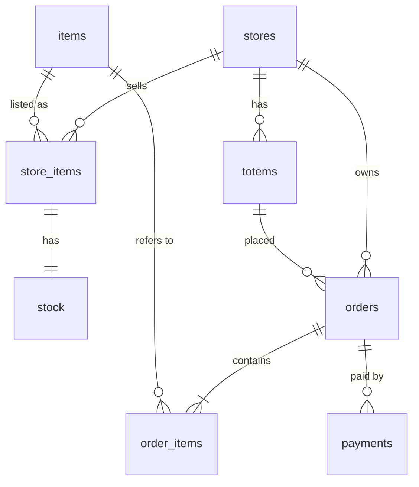

# From one snack bar to thousands of stores

**Status:** Phase 0 implemented (2026-09-14). Phases 1–4 are the plan.
**Supersedes:** the single-location assumptions in `snackbar_checkout_architecture.md`
(ADR-001, ADR-002, ADR-006, ADR-007). ADR-003, ADR-004 and ADR-005 still hold.

## Context

The original architecture is one totem, one local Postgres, one Fastify process,
no network. The business target is now:

- **Thousands of stores** across a country, possibly several countries.
- **Five totems per store**, all selling from the same shelf.
- **One application manages everything**, backed by one central database, at least
  at first.

This is a different architecture, not a scaled-up version of the old one. The
totems become clients of a central system. The hard part of distributed
systems — keeping data consistent across machines — can mostly be avoided here,
because **every sale happens inside exactly one store**. That fact drives
everything below.

## Decision

1. **The store is the partition key.** Every table a store owns carries
   `store_id` as the first column of its primary key. Every request a totem makes
   is addressed to one store. No transaction ever spans two stores.
2. **Start with one API and one database.** Nothing is distributed yet. The
   design only guarantees that each later step (a shared cache, partitioning,
   sharding, regions) is an addition, not a rewrite.
3. **The catalog is global; selling is per store.** What a product *is* lives in
   one place. Whether a store sells it, at what price, in what currency, and how
   much is on the shelf are per store.

Phase 0, below, is done. It changes the data model and the API contract, which
are the two things that are expensive to change once thousands of totems and
years of orders depend on them. Infrastructure (TLS, gateway, shared cache,
shards) is deliberately left for later.

---

## Phase 0: what changed

### Data model

Schema: `001_init.sql`. Nothing is deployed, so the schema is written from
scratch in the one migration rather than amended by a second one.



| Table | Scope | Primary key | Holds |
|---|---|---|---|
| `stores` | global | `id` | code, country, region, timezone, **currency**, locale, **tax rate** |
| `items` | global | `id` | catalog: name, description, image. **No price.** |
| `totems` | store | `(store_id, id)` | the five devices per store |
| `store_items` | store | `(store_id, item_id)` | the store's product range and **price** |
| `stock` | store | `(store_id, item_id)` | quantity and reserved, per store |
| `orders` | store | `(store_id, id)` | now also records `totem_id` |
| `order_items` | store | `(store_id, id)` | price snapshot, as before |
| `payments` | store | `(store_id, id)` | idempotency key unique per store |

Why each change was made:

- **`store_id` first in every primary key.** A distributed Postgres (Citus, or
  shards managed by the application) requires the distribution column in every
  primary key and unique constraint. Adding it later means rewriting every key
  on the largest tables. Adding it now costs a column.
- **Foreign keys carry the store.** `order_items → orders` is
  `(store_id, order_id)`, and `orders → totems` is `(store_id, totem_id)`. The
  database itself rejects an order from a totem registered to another store.
- **Price moved from `items` to `store_items`.** One price per product can't
  express two currencies. `items.price_cents` was dropped rather than kept as a
  second source of truth for what customers are charged.
- **Currency and tax moved onto the store.** Tax used to be one global
  environment variable (`TAX_BASIS_POINTS`), which can't work across
  jurisdictions. It's gone.
- **`stock` references `store_items`.** A store can't hold stock of a product it
  doesn't sell.
- **`order_items.item_id` still references the global catalog**, not
  `store_items`, so order history survives a store dropping a product.
- **Indexes lead with `store_id`.** The one deliberate exception is
  `idx_orders_expiry`, used by the expiry job, which sweeps every store at once
  (after sharding, once per shard).
- **No data migration.** The dev database is rebuilt from this file and
  re-seeded. Once the system is deployed anywhere real, schema changes become
  additive migrations and the procedure below applies.

### API

All store operations now live under `/v1/stores/:storeId`.

| Before | After | Notes |
|---|---|---|
| `GET /health` | `GET /health` | process + database liveness |
| `GET /config` | `GET /v1/stores/:storeId` | currency, locale, tax come from the store |
| `GET /menu` | `GET /v1/stores/:storeId/menu` | response now includes `currency` |
| `POST /session/start` | `POST /v1/stores/:storeId/sessions` | 201 |
| `POST /orders` | `POST /v1/stores/:storeId/orders` | body now requires `totemId` |
| `GET /orders/:orderId` | `GET /v1/stores/:storeId/orders/:orderId` | another store's order is 404 |
| `POST /orders/:orderId/pay` | `POST /v1/stores/:storeId/orders/:orderId/payments` | **201** for every attempt; `status` says the outcome |
| `DELETE /orders/:orderId/abandon` | `POST /v1/stores/:storeId/orders/:orderId/cancel` | orders are never deleted |
| `GET /health/stock` | `GET /v1/stores/:storeId/health/stock` | per store |
| `GET /health/orders` | `GET /v1/stores/:storeId/health/orders` | per store |

The old routes are removed. The totem is the only client and was updated in the
same change.

Conventions:

- **Versioned from day one (`/v1`).** Across thousands of devices, some totems
  will run an old build for weeks. A breaking change becomes `/v2`, served next to
  `/v1` until the fleet has moved.
- **The store id in the path is the routing key.** A gateway can send a request
  to the right shard from the URL alone, without reading the body or the
  database. It's also the cache key.
- **The store is resolved once per request.** A Fastify plugin
  (`src/routes/stores.ts`) loads the store in a `preHandler` hook and exposes it
  as `request.store`. An unknown or deactivated store is `404 store_not_found`.
- **Money always travels with its currency.** Menu and order responses include
  `currency`, because a price in cents means nothing without it.
- **Payments are a collection.** Each POST creates an attempt and returns 201
  whatever the outcome. A declined card isn't an HTTP error; it's a payment whose
  `status` is `failed`.
- **Cancel is an action, not DELETE**, because orders are financial records.

### Input validation

Rewriting the routes was the moment to apply `FASTIFY_FIXES_PLAN.md`. New
store-scoped routes without schemas would have multiplied bug 2 (malformed ids
crashing inside Postgres). All three fixes are in:

- Fastify's own client errors keep their status instead of becoming 500.
- Every route validates params and body with JSON Schema before any code runs.
  Type coercion is off, and unknown fields are dropped, so a client can't send
  its own `totalCents` or `storeId` in the body.
- The JSON parser uses Fastify's poisoning-safe parser again, while still
  accepting empty bodies.

### Totem provisioning

Each totem is told which store and device it is through two build-time
environment variables. The defaults are the seeded `LOCAL-0001` store and its
totem `T1`:

```bash
VITE_STORE_ID=a0000000-0000-4000-8000-000000000002 \
VITE_TOTEM_ID=b0000000-0000-4000-8000-000000000013 \
npm run build --workspace @checkout/totem
```

This is a placeholder for device identity (Phase 1). The URLs the totem calls
won't change when that arrives.

### Seed data

`seeds/menu.sql` now holds two stores with five totems each:

- **`LOCAL-0001`** (USD) keeps the original data exactly: same ids, prices and
  deliberately uneven stock, so existing tests and edge cases still apply.
- **`BR-SP-0001`** (BRL) has its own prices, its own stock, and one fewer product
  (no Iced coffee). It exists to prove stores are independent.

### Verification

| Check | Result |
|---|---|
| API tests | **82 passing**: the previous 55, plus 13 input-validation tests and 12 store-isolation tests, with the route tests rewritten for `/v1`, adding 2 |
| Store-isolation tests catch leaks | Removing the store filter from `getOrder` failed 1 test; letting `reserveStock` lock another store's row failed 3. Both reverted. |
| Data-preserving version of this change | before the schema was consolidated, the same change written as an `ALTER` migration ran in 16 s on a 200k-order database, with row counts, total order value and total reserved stock identical before and after |
| Query plans with **2,001 stores** and 200k stock rows | stock lock 0.09 ms (index only), menu 0.33 ms, stock health 0.09 ms, all on store-first indexes |
| End to end through the totem's proxy | full sale in both stores, each in its own currency; cross-store read → 404; foreign totem → `totem_not_found` |
| Totem | typecheck and production build clean |

---

## Rules to keep

These rules are what keep later phases additive. Code review should enforce
them.

1. **Every store-owned table has `store_id` as the first column of its primary
   key.** New tables included.
2. **Every query on a store-owned table filters by `store_id`**, and joins
   between store-owned tables join on `store_id` too.
3. **No transaction or join ever spans two stores.** Cross-store questions
   (national sales, finance) go to an analytics copy, never the live tables.
4. **Every store-scoped route declares a params schema that includes
   `storeId`.** The store hook trusts that validation already happened.
5. **Money is always stored and returned with its currency.**
6. **Cache keys start with the store id**, and a cache only decides what the
   screen shows, never whether a sale is allowed. Stock reservation always locks
   the real row.
7. **Background jobs that sweep every store** (like expiry) are the one exception
   to rule 2, must say so in a comment, and must be able to run once per shard.

---

## Single-instance assumptions still in the code

These are fine for one API instance and one database. Each is the concrete task
list for a later phase.

| Assumption | Where | Why it's fine now | What replaces it | Phase |
|---|---|---|---|---|
| API listens on localhost only, no auth | `config.ts` `HOST`, ADR-002 | the only client is a browser on the same machine | TLS, per-totem certificates, authenticated API | 1 |
| Store id is trusted from the URL | `routes/stores.ts` | no network exposure | store derived from the device credential; URL checked against it | 1 |
| Menu and store caches live in process memory | `menu.service.ts`, `store.service.ts` | one instance sees every write | shared cache under the same keys (`store:{storeId}:availability`) | 1 |
| Expiry job runs in every API instance | `jobs/session-cleanup.ts` | there is one instance | one job for the whole fleet (leader election), or `FOR UPDATE SKIP LOCKED` | 1 |
| The server talks to the card reader | `payment.service.ts`, `ports/` | fake terminal | cloud-driven reader, or the totem runs the payment and reports it | 1 |
| Order ids are unique per store, not globally | `001_init.sql` | random UUIDs don't collide in practice | nothing, unless ids ever become non-random | — |
| Migrations run in one transaction, and the schema is rewritten in place | `db/migrate.ts`, `001_init.sql` | nothing is deployed and no data matters | additive migrations, applied with the online procedure below | 1 |
| Stock and order health checks are per store | `routes/store-info.ts` | a person checks one store | a central job that collects them into a fleet dashboard | 1 |
| One connection pool, sized for one database | `db/pool.ts` | a single Postgres serves every store | one pool per shard, keyed by store; PgBouncer in front | 2-3 |
| Catalog names are in one language | `items.name` | one locale per seeded product | translations per locale | 4 |
| `stores.region` is stored but unused | `001_init.sql` | nothing to place yet | decides which shard or region a store lives in | 3–4 |

---

## Roadmap

Each phase starts when its trigger is actually hit, not before.

### Phase 1: central and multi-instance

**Trigger:** before the first real store other than the pilot goes live.

- TLS everywhere. Each totem gets its own identity (a per-device certificate)
  and the server derives `storeId` and `totemId` from it.
- Several API instances behind a load balancer. The balancer's idle timeout must
  be longer than the payment window (45 s today).
- Menu availability and store settings move to a shared cache, keyed by store.
- The expiry job runs once for the fleet, not once per instance.
- Connection pooling in front of Postgres (for example PgBouncer), since many API
  instances each open their own connections.
- Card readers that the server can reach through the processor's cloud, or
  payment driven from the totem.
- Logs and metrics tagged with `store_id` and `totem_id`.
- **Decide what a store does without internet.** See the open decisions below.

### Phase 2: stretch the single database

**Trigger:** the central database approaches its limits: sustained CPU, write
latency, or `orders` too large to maintain comfortably.

- Partition `orders`, `order_items` and `payments`: by time for archiving, or by
  a hash of `store_id` for write spread. The composite keys from Phase 0 already
  allow either.
- Read replicas for menus and reporting.
- Sales flow into an analytics store (for example ClickHouse, as the arch doc
  suggests) through change-data capture or an outbox table. National reports
  never query the live tables again.

### Phase 3: shard by store

**Trigger:** one database server can't hold the write load even after Phase 2.

- A lookup table maps each store to a shard, rather than a hash formula, so one
  busy store can move without reshuffling the rest:

  ```sql
  CREATE TABLE store_shards (
    store_id  UUID PRIMARY KEY REFERENCES stores(id),
    shard     TEXT NOT NULL,
    moved_at  TIMESTAMPTZ
  );
  ```

- The gateway routes by the `storeId` in the path (Phase 0 made that possible).
- Tables are distributed by `store_id` (Citus, or shards managed by the
  application). Global tables (`stores`, `items`) are replicated to every shard.
- Moving a store: pause its writes briefly, copy its rows, update
  `store_shards`.
- The expiry job runs once per shard.

### Phase 4: several countries

**Trigger:** stores outside the first country.

- Regional placement: `stores.region` decides where a store's shard lives, for
  latency and data-residency law.
- Reports that convert between currencies, with the exchange rate recorded at
  the time of sale.
- Reports in each store's local time, using `stores.timezone`.
- Catalog translations.
- Tax beyond a single percentage per store (item-level rates, tax-inclusive
  pricing rules).

---

## Changing this schema once it is deployed

Until the first real deployment, schema changes mean editing `001_init.sql` and
rebuilding. After that, they must be additive migrations, and a large table
cannot be rewritten in one transaction without holding locks on everything for
the whole run.

For reference, this multi-store shape was first written as an `ALTER` migration
and measured at 16 seconds on a 200k-order database in a single transaction —
acceptable offline, not acceptable on a live one. The same change without
downtime, using adding `store_id` as the example:

1. **Expand.** Create `stores`, `totems` and `store_items`. Add `store_id` and
   `totem_id` as nullable columns. Both steps are near-instant.
2. **Deploy code that writes both shapes**, filling the new columns on every
   insert.
3. **Backfill in batches** of a few thousand rows, committing each batch.
4. **Add foreign keys as `NOT VALID`**, then `VALIDATE CONSTRAINT` separately.
   Validation doesn't block writes.
5. **Build the new indexes with `CREATE INDEX CONCURRENTLY`**, including a unique
   index on `(store_id, id)`. This can't run inside a transaction, so it can't go
   through the current migration runner.
6. **Swap primary keys** with `ALTER TABLE … ADD CONSTRAINT … PRIMARY KEY USING
   INDEX`, which reuses the index from step 5 and takes only a brief lock.
7. **Contract.** Deploy code that reads only the new shape, then drop the old
   constraints and `items.price_cents`.

---

## Open decisions

1. **What happens when a store loses internet?** In the central model, a store
   without connectivity can't sell. The alternative is a small server in each
   store running today's application, syncing sales to the center. Phase 0
   doesn't choose: the same `store_id` design works for both. This needs a
   business answer before Phase 1.
2. **Tax model.** Every seeded store has a tax rate of 0 (prices include tax). A
   real rate per jurisdiction is needed before launch.
3. **Pricing.** Prices are per store today. If regions share price lists, a
   price-list table between `stores` and `store_items` avoids updating thousands
   of rows per change.
4. **Where does the store and totem registry live?** Today, SQL inserts. Fleet
   operations will need an admin API or back-office for opening stores and
   registering totems.

## What happens to the original ADRs

| ADR | Now |
|---|---|
| 001 Single machine | Replaced by this document. Phase 0 still runs on one machine, but nothing assumes it. |
| 002 No auth, localhost only | Still true for Phase 0. Must be replaced in Phase 1. |
| 003 Synchronous payment | Holds. The payment endpoint moved but keeps the same behavior. |
| 004 Pessimistic stock locking | Holds, now per `(store, item)`. The five totems of a store share the same locks. |
| 005 Money in integer cents | Holds, with each amount's currency now recorded. |
| 006 Local Postgres | Replaced by one central Postgres, designed to be split by store. |
| 007 Offline-first | Suspended pending open decision 1. |
